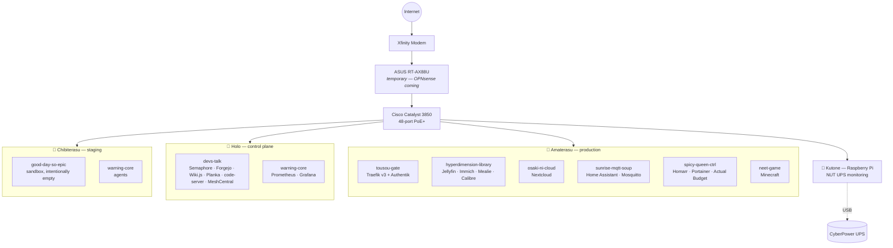

# 🐺 Johto

A self-hosted homelab, provisioned end-to-end with Ansible and run entirely in Docker. Every host is named after a wolf or guardian deity, every stack after a HANABIE song, and the whole fleet lives under one environment name — **Johto**.


[](LICENSE)

---

## What's actually running here



Every host runs its stacks as plain Docker Compose files, generated and deployed by Ansible — no Kubernetes here (yet; see [Roadmap](#roadmap)).

## The fleet

| Host | Hardware | Role | Status |
|---|---|---|---|
| **Amaterasu** | MSI Z590 PRO WiFi, i5, Quadro P620 | Production | 🟡 Live on the legacy stack — new deploy pending |
| **Holo** | Intel NUC7i5BNK | Ansible control plane, CI/CD, monitoring | 🟢 Live |
| **Chibiterasu** | Lenovo ThinkCentre M920q, i7-8700T | Staging / pre-prod validation | 🟢 Live |
| **Kutone** | Raspberry Pi 3B+ | UPS monitoring (NUT server) | 🟢 Live |
| **Lycagon** | ASRock Z490M-ITX/ac | Edge router (OPNsense) | ⚪ Not yet configured |
| **Fenrir** | Synology RS815 | NAS | 🟢 In service |
| **Sif** | Lenovo ThinkCentre M910s | Future NAS rebuild | 🟡 Migration source, still on the old stack |

## The stacks

Every stack name is a HANABIE song, reworked to hint at what it does.

| Stack | Named for | What it runs |
|---|---|---|
| `tousou-gate` | TOUSOU | Traefik v3 reverse proxy + Authentik SSO |
| `hyperdimension-library` | Hyperdimension Galaxy | Jellyfin, Immich, Mealie, Calibre |
| `osaki-ni-cloud` | Osaki ni Shitsurei Shimasu | Nextcloud |
| `sunrise-mqtt-soup` | Sunrise Miso-Soup | Home Assistant, Mosquitto |
| `spicy-queen-ctrl` | Spicy Queen | Homarr, Portainer, WhatUpDocker, Actual Budget |
| `neet-game` | NEET GAME | Minecraft |
| `devs-talk` | Girl's Talk | Semaphore, Forgejo, Wiki.js, Planka, code-server, MeshCentral |
| `warning-core` | Warning!! | Prometheus + Grafana (Holo), agent-only elsewhere |
| `good-day-so-epic` | Today's Good Day & So Epic | Sandbox — intentionally empty, Chibiterasu only |

## Naming conventions

Three axes, deliberately kept separate so nothing collides:

- **Hosts** → wolf and guardian deities (Amaterasu, Holo, Fenrir, Lycagon...)
- **Stacks** → HANABIE song and album wordplay
- **Environment** → **Johto**, a place name, orthogonal to both

## Repo layout

```
docker/
├── stacks/<stack-name>/compose.<hostname>.yml   # one compose file per host
└── configs/<service>/...                        # synced to /docker/configs/<service> by Ansible
roles/
├── initialize/            # base packages, sudo, PEP 668 handling
├── geerlingguy.docker/    # Docker CE + Compose plugin
├── container-configs/     # writes .env.<hostname> from vault, syncs configs
├── containers/            # copies compose files, starts stacks in order
└── nut-client/            # upsmon — UPS shutdown signal client
inventory                  # docker-hosts, nas_hosts, k3s_nodes
playbook.yml                # the whole thing, tagged per-role
PROGRESS.md                # detailed, living status log
DECISIONS.md                # the "why" behind non-obvious choices
```

## Deploying

The playbook always runs **from Holo** (`ansible_connection=local` in the inventory) — it's the fleet's control plane, not any of the machines running Ansible against it.

```bash
# 1. Holo first — it's the control plane
ansible-playbook playbook.yml --limit holo

# 2. Chibiterasu — validates the deploy path before it touches production
ansible-playbook playbook.yml --limit chibiterasu

# 3. Amaterasu — production, last
ansible-playbook playbook.yml --limit amaterasu
```

Secrets live in `ansible-vault`-encrypted `host_vars/*/vault.yml` files — nothing sensitive is ever committed in the clear.

## Roadmap

- **Phase 1** *(current)* — Lycagon/OPNsense live, Amaterasu on the new stack, full monitoring + UPS shutdown coverage
- **Phase 2** — K3s cluster (repurposed NUC workers + a dedicated control plane) in a DeskPi RackMate T1
- **Phase 3** — Permanent 2.5G switch, QSFP uplink to Lycagon

Full status detail lives in [`PROGRESS.md`](PROGRESS.md); the reasoning behind non-obvious choices is in [`DECISIONS.md`](DECISIONS.md).
