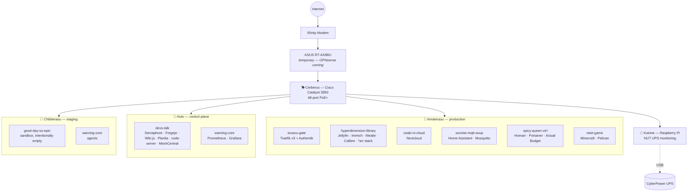

# 🐺 Johto

A self-hosted homelab, provisioned end-to-end with Ansible and run entirely in Docker. Every host is named after a wolf or guardian deity, every stack after a HANABIE song, and the whole fleet lives under one environment name — **Johto**.


[](LICENSE)

---

## What's actually running here



Every host runs its stacks as plain Docker Compose files, generated and deployed by Ansible — no Kubernetes here (yet; see [Roadmap](#roadmap)).

## The fleet

| Host | Hardware | Role | Status |
|---|---|---|---|
| **Amaterasu** | MSI Z590 PRO WiFi, i5, Quadro P620 | Production | 🟢 Live — fully deployed on the new stack |
| **Holo** | Intel NUC7i5BNK | Ansible control plane, CI/CD, monitoring | 🟢 Live |
| **Chibiterasu** | Lenovo ThinkCentre M920q, i7-8700T | Staging / pre-prod validation | 🟢 Live |
| **Kutone** | Raspberry Pi 3B+ | UPS monitoring (NUT server) + Discord Site Monitor Bot | 🟢 Live — powered from the UPS's own battery-backed outlets |
| **Lycagon** | ASRock Z490M-ITX/ac | Edge router (OPNsense) | ⚪ Not yet configured |
| **Fenrir** | Synology RS815 | NAS | 🟢 In service |
| **Sif** | Lenovo ThinkCentre M910s | Ansible-managed, future NAS | 🟢 Live — legacy stack wiped, warning-core running; NAS storage pending a drive install |
| **Zinogre** | Intel NUC | Game server (idle) | ⚪ Stopped — Palworld migrated to Amaterasu 2026-09-25, kept as a cold fallback |
| **Cerberus** | Cisco Catalyst 3850-48P | Core switch | 🟢 Live — reinstalled, VLANs correct fleet-wide, SSH access configured |
| **Orthrus** | NETGEAR GS108PEv3 | Edge switch, DeskPi RackMate T1 | 🟢 Live — static IP, loop detection on, firmware current (2.06.24) |

All three Docker hosts (Amaterasu, Holo, Chibiterasu) are now fully deployed and verified on the stack-based architecture above — the last piece to land was Amaterasu, which turned out to already be most of the way there once actually audited, rather than the ground-up migration originally assumed.

## Rack layout

Two physical racks — the big stuff in a 15U rack, the small stuff in a DeskPi RackMate T1.

```
Main rack — 15U (17" external depth, 12" usable)
┌────┬──────────────────────────────────────┐
│ 1U │ Patch panel                           │
├────┼──────────────────────────────────────┤
│ 1U │ Cerberus — Cisco Catalyst 3850 *      │
├────┼──────────────────────────────────────┤
│ 1U │ CyberPower outlet strip               │
├────┼──────────────────────────────────────┤
│ 1U │ (empty)                               │
├────┼──────────────────────────────────────┤
│    │                                       │
│ 2U │ Sif                                   │
│    │                                       │
├────┼──────────────────────────────────────┤
│ 1U │ (empty)                               │
├────┼──────────────────────────────────────┤
│ 1U │ Fenrir                                │
├────┼──────────────────────────────────────┤
│ 1U │ (empty)                               │
├────┼──────────────────────────────────────┤
│    │                                       │
│    │                                       │
│ 3U │ Amaterasu *                           │
│    │                                       │
├────┼──────────────────────────────────────┤
│    │                                       │
│    │                                       │
│ 3U │ (empty — reserved for growth)         │
│    │                                       │
└────┴──────────────────────────────────────┘
* on 5"-8" adjustable rack extenders. 120mm exhaust fan mounted above the
  patch panel; a second fan slot is reserved for later.

DeskPi RackMate T1 — small/edge devices
┌────┬──────────────────────────────────────┐
│ 1U │ Orthrus — NETGEAR GS108PEv3           │
├────┼──────────────────────────────────────┤
│ 1U │ Chibiterasu                           │
├────┼──────────────────────────────────────┤
│ 1U │ Zinogre                               │
├────┼──────────────────────────────────────┤
│ 1U │ Holo                                  │
├────┼──────────────────────────────────────┤
│    │                                       │
│    │                                       │
│ 4U │ (empty)                               │
│    │                                       │
└────┴──────────────────────────────────────┘
```

## The stacks

Every stack name is a HANABIE song, reworked to hint at what it does.

| Stack | Named for | What it runs |
|---|---|---|
| `tousou-gate` | TOUSOU | Traefik v3 reverse proxy + Authentik SSO |
| `hyperdimension-library` | Hyperdimension Galaxy | Jellyfin, Immich, Mealie, Calibre, Prowlarr/Sonarr/Radarr/Bazarr/qBittorrent (behind gluetun/PIA)/Jellyseerr/FlareSolverr |
| `osaki-ni-cloud` | Osaki ni Shitsurei Shimasu | Nextcloud |
| `sunrise-mqtt-soup` | Sunrise Miso-Soup | Home Assistant, Mosquitto |
| `spicy-queen-ctrl` | Spicy Queen | Homarr, Portainer, WhatUpDocker, Actual Budget |
| `neet-game` | NEET GAME | Minecraft, Pelican (game-server panel, for future servers) |
| `devs-talk` | Girl's Talk | Semaphore, Forgejo, Wiki.js, Planka, code-server, MeshCentral |
| `warning-core` | Warning!! | Prometheus + Grafana (Holo), agent-only elsewhere |
| `good-day-so-epic` | Today's Good Day & So Epic | Sandbox — intentionally empty, Chibiterasu only |

## Remote access

No public ports, no reverse-proxy-to-the-internet — the fleet is reachable
remotely over [Tailscale](https://tailscale.com) (mesh VPN) instead. New
infrastructure hosts join under a tagged device identity rather than a
personal one, which also means no periodic manual re-auth for boxes that
run unattended. An earlier attempt at exposing a service directly to the
public internet via a tunnel was tried and reverted — see `DECISIONS.md`.

## Naming conventions

Three axes, deliberately kept separate so nothing collides:

- **Hosts** → wolf and guardian deities (Amaterasu, Holo, Fenrir, Lycagon, Cerberus, Orthrus...)
- **Stacks** → HANABIE song and album wordplay
- **Environment** → **Johto**, a place name, orthogonal to both

## Repo layout

```
docker/
├── stacks/<stack-name>/compose.<hostname>.yml   # one compose file per host
└── configs/<service>/...                        # synced to /docker/configs/<service> by Ansible
roles/
├── initialize/            # base packages, sudo, PEP 668 handling
├── geerlingguy.docker/    # Docker CE + Compose plugin
├── container-configs/     # writes .env.<hostname> from vault, syncs configs
├── containers/            # copies compose files, starts stacks in order
├── nut-client/            # upsmon — UPS shutdown signal client
└── tailscale/             # joins the tailnet, idempotent
inventory                  # docker-hosts, nas_hosts, k3s_nodes, misc_hosts, tailscale_hosts
playbook.yml                # the whole thing, tagged per-role
PROGRESS.md                # detailed, living status log
DECISIONS.md                # the "why" behind non-obvious choices
```

## Deploying

The playbook always runs **from Holo** (`ansible_connection=local` in the inventory) — it's the fleet's control plane, not any of the machines running Ansible against it.

A personal Mac holding a full clone of this repo (including the gitignored vault password and SSH keys) is a **parity/disaster-recovery copy**, not a second control plane. Normal flow is still edit → commit/push → SSH to Holo → `git pull` → deploy from there. Only run Ansible directly from a personal Mac if Holo itself is unreachable — and treat that as a break-glass fallback, not a routine alternative. Whichever machine you're on, keep it on the same commit as Holo (`git pull` before assuming anything's current) rather than letting a personal clone drift into its own state.

```bash
# 1. Holo first — it's the control plane
ansible-playbook playbook.yml --limit holo

# 2. Chibiterasu — validates the deploy path before it touches production
ansible-playbook playbook.yml --limit chibiterasu

# 3. Amaterasu — production, last
ansible-playbook playbook.yml --limit amaterasu
```

Secrets live in `ansible-vault`-encrypted `host_vars/*/vault.yml` files — nothing sensitive is ever committed in the clear.

## Roadmap

**Phase 1 — Foundation** 🟡 *mostly done*
- [x] Plan: services, device inventory, OS choices, device↔service mapping
- [x] Hardware: fleet racked and health-checked
- [x] Network: switch reinstalled, VLANs correct fleet-wide
- [ ] Network: Lycagon/OPNsense as the real router (still a consumer router today)
- [x] Ansible control plane on Holo (push + pull access, Semaphore installed)

**Phase 2 — Core Services Live** ✅ *done*
- [x] Staging (Chibiterasu) deployed and verified
- [x] Production (Amaterasu) deployed and verified — all 7 stacks live

**Phase 3 — Resilience** 🟡 *in progress*
- [x] UPS monitoring (NUT) — verified end-to-end, every host connected
- [x] Kutone moved to the UPS's protected outlet bank
- [ ] UPS batteries swapped (funds-gated) — the one remaining gap for real outage protection
- [x] NAS backup solution + a real 3-2-1 strategy — restic backs up Amaterasu to Fenrir
      nightly (the "2"), verified working; see PROGRESS.md for the full writeup

**Phase 4 — Scale** *(later)*
- [ ] Permanent 2.5G switch, QSFP uplink to Lycagon

Full status detail lives in [`PROGRESS.md`](PROGRESS.md); the reasoning behind non-obvious choices is in [`DECISIONS.md`](DECISIONS.md).
